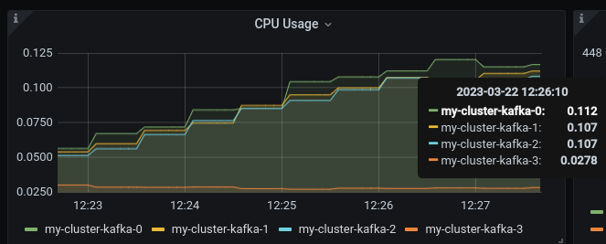

= AMQ Streams (Kafka) demo

The goal of this demo is to show some of the key capabilities of Red Hat AMQ Streams.

One of the key feature of *Red Hat® AMQ Streams* is bringing the power of *Apache Kafka* in *OpenShift Container Platform*, leveraging the Strimzi project.footnote:[https://strimzi.io/]

== Create Kafka broker and topic

Add **AMQ Streams** operator to your OpenShift environment.

Create a Broker with metrics enabled:

- consumer lag
- consumer offsets

[source,ruby]
----
oc new-project my-kafka
oc apply -f k8s/01-kafka-metrics.yaml
oc apply -f k8s/02-kafkatopic.yaml
----

== Enabling monitoring

NOTE: This demo relies on the _cluster-admin_ role.

Create cluster-monitoring-config ConfigMap object:

[source,shell]
----
oc apply -f k8s/03-cluster-monitor.yaml
----

Check that the prometheus-operator, prometheus-user-workload and thanos-ruler-user-workload pods are running in the openshift-user-workload-monitoring project. It might take a short while for the pods to start:

[source,shell]
----
oc -n openshift-user-workload-monitoring get pod
----

Enable:
- monitoring for kafka resources
- prometheus rules

[source,shell]
----
oc apply -f k8s/04-pod-monitor.yaml -n my-kafka
oc apply -f k8s/05-prometheus-rules.yaml -n my-kafka
----

Create a service account for Grafana:

[source,shell]
----
oc apply -f k8s/06-graphana-auth.yaml -n my-kafka
----

Create Prometheus datasource for Grafana and deploy Grafana

[source,shell]
----
k8s/07-create-datasource.sh
oc apply -f k8s/08-grafana.yaml
oc create route edge --service=grafana --namespace=my-kafka
----

Login with the default credentials (`admin/admin`) and then change the password.

Load the dashboard definitions from `grafana-dashboards` folder:

- `strimzi-kafka.json`
- `strimzi-kafka-exporter.json`

== Install the consumer and producer applications

[source,shell]
----
mvn -f kafka-consumer/pom.xml package -Dquarkus.kubernetes.deploy=true -DskipTests
mvn -f kafka-producer/pom.xml package -Dquarkus.kubernetes.deploy=true -DskipTests
----

Further information about the applications:

* xref:kafka-consumer/README.md[Consumer App Readme]

* xref:kafka-producer/README.md[Producer App Readme]

== Demo routines

=== AMQ Streams High Availability

. Show consumer logs
+
[source,shell]
----
oc logs --tail=20 -f --selector="app.kubernetes.io/name=kafka-consumer"
----

. Show producer logs
+
[source,shell]
----
oc logs --tail=20 -f --selector="app.kubernetes.io/name=kafka-producer"
----

. Show the topic distribution
+
[source,shell]
----
oc exec -it my-cluster-kafka-0 -- bin/kafka-topics.sh \
                                --bootstrap-server my-cluster-kafka-bootstrap:9092 \
                                --describe --topic event
----

. Test the Kafka's resiliance and consistency by brutely shutting down one of brokers' pod.
+
TIP: Use the following command: `oc delete --force pod <pod-name>`
+
IMPORTANT: Watching at the consumer log you should notice that it temporarily stops processing some messages (missing messages). This is expected! In fact, Kafka promotes consistency over availability, so until a new partition leader is elected you cannot write or consume messages on that partition. Eventually, the new leader will become available and the missing messages will be caught up.

. Show again the topic distribution on the cluster members

. Show the dashboard

=== AMQ Streams Rebalancing

. Add the Cruise Control
+
[source,shell]
----
oc patch kafka my-cluster --patch '{"spec":{"cruiseControl": {}}}' --type=merge
----

. Point out the partition leaders
+
[source,shell]
----
oc exec -it my-cluster-kafka-0 -- bin/kafka-topics.sh \
            --bootstrap-server my-cluster-kafka-bootstrap:9092 \
            --describe --topic event
----

. Change the producer to create messages on a set of partitions which have the same leader
+
[source,shell]
----
oc edit configmap kafka-producer-config
----
+
update the variables in order to produce only on selected partitions, e.g.:
+
[source,shell]
----
  PRODUCER_PARTED: "true"
  PRODUCER_PARTITIONS: 0,3,6
----
+
bump the kafka producer application:
+
[source,shell]
----
oc scale deployment/kafka-producer --replicas=0
oc scale deployment/kafka-producer --replicas=1
----

. Check that partitions grows at different paces, running the following command:
+
[source,shell]
----
oc exec -it my-cluster-kafka-0 -- bin/kafka-run-class.sh kafka.tools.GetOffsetShell --broker-list localhost:9092 --topic event
----

. Deploy the rebalance configuration which will trigger the optimization analysis:
+
[source,shell]
----
oc apply -f k8s/10-kafka-rebalance-full.yaml
----

. Review the optimization proposal:
+
[source,shell]
----
oc describe kafkarebalance full-rebalance
----

. Approve the proposal
+
[source,shell]
----
oc annotate kafkarebalances.kafka.strimzi.io full-rebalance strimzi.io/rebalance=approve
----
+
[TIP]
==== 
It's possible to trigger a new analysis on the existing rebalancing configuration:

[source,shell]
----
oc annotate kafkarebalances.kafka.strimzi.io full-rebalance strimzi.io/rebalance=refresh
----
====

. Rebalancing takes some time, run again the following command and wait for `Status: True`
+
[source,shell]
----
oc describe kafkarebalance full-rebalance
----

. Run again the describe topic command, you should spot the overloaded partitions moved on different leaders:
+
[source,shell]
----
oc exec -it my-cluster-kafka-0 -- bin/kafka-topics.sh \
            --bootstrap-server my-cluster-kafka-bootstrap:9092 \
            --describe --topic event
----

When the Kafka cluster scales, existing topics do not leverage the newly available brokers, so they remain idle until new topics are created.
The Cruise Control can be used to evenly distribute existing topics on the new available resources, as the following steps will show:

. Increase the Kafka replicas:
+
[source,shell]
----
oc patch kafka my-cluster --patch '{"spec":{"kafka": {"replicas": 4}}}' --type=merge
----

. Change the producer configurations to create an evenly distributed workload:
+
[source,shell]
----
oc edit configmap/kafka-producer-config
----
+
Modify the environment variables:
+
[source,shell]
----
  PRODUCER_PARTED: "false"
  PRODUCER_TICK_FREQUENCY: "10"
----

. Restart the producer and consumer application

. Open the Grafana dashboard, after a few minutes, the CPU graph should look like the following:
+

+
The new broker uses less resources.

. Watching at the topic information confirms that all partitions are on the first 3 brokers (0,1,2)
+
[source,shell]
----
oc exec -it my-cluster-kafka-0 -- bin/kafka-topics.sh \
            --bootstrap-server my-cluster-kafka-bootstrap:9092 \
            --describe --topic event
----

. Deploy the rebalance configuration `mode: add-brokers`, which is tailored to leverage the new available brokers:
+
[source,shell]
----
oc apply -f k8s/11-kafka-rebalance-add-brokers.yaml
----

. Review and approve the optimization proposal:
+
[source,shell]
----
oc describe kafkarebalance full-rebalance
oc annotate kafkarebalances.kafka.strimzi.io full-rebalance strimzi.io/rebalance=approve
----

. Rebalancing takes a couple of minutes, you can monitor the Grafana dashboard to see the changes and the topic information to understand how the partitions and their replicas are reorganized across the brokers.

. Finally, you can ask the Cruise Control to shrink your partitions on less brokers and then scale the cluster down.

=== Persist Consumed Messages

In this section, the consumer is enhanced to store the messages in a Postgres DB.
The goal is to show the client scalability and resiliance

. Stop the consumer and producer and restore the normal producer behavior
+
[source,shell]
----
oc scale deployment kafka-consumer --replicas=0
oc scale deployment kafka-producer --replicas=0
oc edit configmap kafka-producer-config
----
+
update the evironment variable to its original value
+
[source,shell]
----
  PRODUCER_PARTED: "false"
----

. Deploy the database (basic ephemaral deployment)
+
[source,shell]
----
oc create configmap event-db-init-data --from-file=./kafka-producer/src/main/resources/import.sql
oc apply -f k8s/20-postgres.yaml
----

. Edit the consumer configuration to enable persistence:
+
[source,shell]
----
oc edit configmap/kafka-consumer-config
----
+
Change this environment variable: `TRACKING_DB: "true"`

. Reset the producer and the consumer
+
[source,shell]
----
oc scale deployment kafka-consumer --replicas=1
oc scale deployment kafka-producer --replicas=1
----

. Deploy a simple Python application to poll the DB and detect duplicate or missing messages
+
[source,shell]
----
oc new-build --strategy docker --binary --name=db-watcher
oc start-build db-watcher --from-dir python-db-watcher/ --follow
oc new-app -l app.kubernetes.io/part-of=event-application -e POSTGRES_SVC=event-db db-watcher
----

. Open the db-watcher logs
+
[source,shell]
----
oc logs --tail 10 -f --selector="deployment=db-watcher"
----
+
NOTE: At this point, there should be no missing or duplicate messages, so the log should be empty.

. Scale up the consumer
+
[source,shell]
----
oc scale deployment kafka-consumer --replicas=2
----
+
NOTE: When the new consumer pod become active, the other consumer gives up half of his partitions to the new one. For a while you should spot some missing messages in `db-watcher` log. However, it's a transient condition.

. Test the consumer's resiliance and consistency by brutely shutting down one of the two pods.
+
TIP: Use the following command: `oc delete --force pod <pod-name>`

=== Probing the producer

Up to now, the producer has been using an in-memory counter to generate an ordered sequence of messages.

By changing the producer configuration, it's possible to leverage a PostgresSQL sequence to maintain a shared counter. As a result, it's possible to scale up the producer and probe the producer failover.

. Open the producer configuration and set `SEQUENCE_DB`to `true`
+
[source,shell]
----
oc edit configmap kafka-producer-config
----

. Restart the producer scaling it down and up to 2 instance:
+
[source,shell]
----
oc scale deployment kafka-producer --replicas=0
oc scale deployment kafka-producer --replicas=2
----

. After a few seconds you can start dropping the producer pods: 
+
[source,shell]
----
oc delete --force pod kafka-producer-<id> 
----

. Analyzing the db-watcher log, you are unlikely to find a missing message, because you should stop the producer at the exact moment when it gets the sequence number from the DB and before it sends it to Kafka. For educational purposes, the producer exposes an endpoint which throw a runtime exception at exactly that point:

* Open a shell into one of the producer pod:
+
[source,shell]
----
oc rsh kafka-producer-5d8856fb9f-cmt7r
----

* Inject and HTTP PUT request on the local endpoint:
+
[source,shell]
----
$ curl -X PUT localhost:8080
----

. Now, looking at the db-watcher log you should see a missing message.

== Clean up

In order to start the demo from scratch, with minimal effort: delete only the kafka broker and the topics:

[source,shell]
----
oc delete kafkatopics --selector="strimzi.io/cluster=my-cluster"
oc delete kafka my-cluster
----

Drop the PVC:

[source,shell]
----
oc delete pvc --selector="strimzi.io/cluster=my-cluster"
----

Then, you can apply again the first two yaml files.

=== Database clean up

[source,shell]
----
oc rsh event-db-<id>
$ psql -U quarkus quarkus
quarkus=> DELETE FROM event;
quarkus=> ALTER SEQUENCE event_seq RESTART WITH 1;
----
