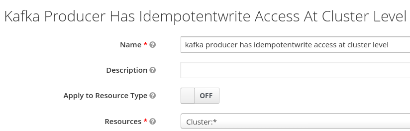

= Keycloak integration Appendix

In this document there alternative configurations:

== Keycloak self signed CA

If your OpenShift cluster relies on a self signed CA also the Keycloak endpoint share the same CA.

In this case you have to add the self signed CA to the Kafka configuration.

Extract the Keycloak CA certificate:

[source,shell]
----
echo "" | openssl s_client -servername $KEYCLOAK_ROUTE -connect $KEYCLOAK_ROUTE:443 -prexit 2>/dev/null| openssl x509 -outform PEM > keycloak-ext.crt
----

Create a secret to hold the Keycloak CA:

[source,shell]
----
oc create secret generic oauth-server-cert --from-file=ca.crt=keycloak-ext.crt 
----

Update the listeners configuration:

[source,shell]
----
oc patch kafka/my-cluster --type=merge --patch-file=(cat k8s/keycloak/05-kafka-listener-self-signed.yaml.patch | envsubst | psub)
----

TIP: Bash alternative: `oc patch kafka/my-cluster --type=merge -p "$(cat k8s/keycloak/05-kafka-listener-self-signed.yaml.patch | envsubst)"`

== Client side configuration

In this section, you will configure the *kafka consumer* in your local environment to connect to the remote Kafka server using the OAuth authentication mechanism:

The client application needs to enstablish 2 TLS connections, in this example both endpoints are using self signed CA, so we create 2 truststores for Kafka and Keycloak respectively:

[source,shell]
----
oc get kafka my-cluster -o=jsonpath='{.status.listeners[?(@.name=="external")].certificates[0]}{"\n"}' > kafka-cluster-ca.crt
keytool -import -trustcacerts -alias root -file kafka-cluster-ca.crt -keystore truststore.jks -storepass password -noprompt
keytool -import -trustcacerts -alias root -file keycloak-ext.crt -keystore oauth-ssl-truststore.jks -storepass password -noprompt
----

Add application properties to enable the OAUTHBEARER authentication:

[source,shell]
----
set -x KAFKA_ROUTE (oc get kafka my-cluster -o jsonpath='{.status.listeners[?(@.name=="external")].bootstrapServers}')
echo | cat - k8s/keycloak/06-application.properties | envsubst >> kafka-consumer/src/main/resources/application.properties
----

Update the password in `application.properties` to match the secret in the Keycloak web console.

Make sure that OAuth dependecy is present in `pom.xml`

[source,xml]
----
<dependency>
  <groupId>io.strimzi</groupId>
  <artifactId>kafka-oauth-client</artifactId>
</dependency>
----

Run the Kafka consumer:

[source,shell]
----
mvn -f kafka-consumer/pom.xml clean quarkus:dev
----

The following command adds the OAuth configuration to the producer using the respective `kafka-producer` user.

[source,shell]
----
echo | cat - k8s/keycloak/06-application.properties | envsubst | sed 's/consumer/producer/g' >> kafka-producer/src/main/resources/application.properties
----

== Enable OAuth for client applications in OpenShift

Once the authorization is enabled at Kafka level, client applications cannot access to Kafka in an anonymous way, even if the connection comes from an internal listener. For such a reason, make sure that authentication is enabled on all your listeners.

WARNING: the following procedure is designed to work with a self signed Keycloak certificate.

Create a secret to hold the trust stores:

[source,shell]
----
oc create secret generic kafka-client-truststores --from-file=truststore.jks --from-file=oauth-ssl-truststore.jks 
----

In order to update the OpenShift application deployment there are two options:

. Update the image building process via quarkus-openshift extension
. Update the existing deployment configurations

=== Update the image building process

Edit the _configmap_ in `kafka-consumer/src/main/kubernetes/openshift.yml` using the values from the following command:

[source,shell]
----
cat k8s/keycloak/09-configmap-self-signed.template | envsubst
----

WARNING: Make sure that the previous `KAFKA_BOOTSTRAP_SERVERS` value is replaced.

Update `kafka-consumer/src/main/resources/application.properties`

[source,props]
----
quarkus.openshift.mounts.trustores-vol.path=/truststores
quarkus.openshift.secret-volumes.trustores-vol.secret-name=kafka-client-truststores
----

Finally, launch the image build:

[source,shell]
----
mvn -f kafka-consumer/pom.xml package -Dquarkus.kubernetes.deploy=true -DskipTests
----

Repeat the above procedure for the _producer_ application, but replace the client id and secrets accordingly.

=== Update the existing deployment configuration

The below instructions assume that the client applications are correctly functioning without authentication.

Edit the _configmaps_ issuing the following command:

[source,shell]
----
oc edit configmap kafka-consumer-config
----

Add configuration coming from following command:

[source,shell]
----
cat k8s/keycloak/09-configmap-self-signed.template | envsubst
----

Update the Kafka consumer deployment to mount the secret containing the trust stores.

TIP: the following command line leverages the popular `jq` command line utility (http://stedolan.github.io/jq/).

[source,shell]
----
oc get deployment kafka-consumer -o json | jq '.spec.template.spec += { "volumes": [ { "name": "truststores-vol", "secret": { "secretName": "kafka-client-truststores" } } ] }' | jq '.spec.template.spec.containers[] += { "volumeMounts": [ { "name": "truststores-vol", "mountPath": "/truststores", "readOnly": true } ] } ' | oc apply -f -
----

Edit the producer _configmaps_ issuing the following command:

[source,shell]
----
oc edit configmap kafka-producer-config
----

Add configuration coming from following command:

[source,shell]
----
cat k8s/keycloak/09-configmap-self-signed.template | envsubst | sed 's/consumer/producer/g'
----

Update the Kafka producer deployment to mount the secret containing the trust stores:

[source,shell]
----
oc get deployment kafka-producer -o json | jq '.spec.template.spec += { "volumes": [ { "name": "truststores-vol", "secret": { "secretName": "kafka-client-truststores" } } ] }' | jq '.spec.template.spec.containers[] += { "volumeMounts": [ { "name": "truststores-vol", "mountPath": "/truststores", "readOnly": true } ] } ' | oc apply -f -
----

== Super user configuration

To skip the authorization check, you can use a user with special powers AKA `superuser`.

Enable the authentication on the plain listener:

[source,yaml]
----
spec:
  kafka:
    listeners:
      - name: plain
        port: 9092
        type: internal
        tls: false
        authentication:
          type: scram-sha-512
----

Create `superuser`:

[source,shell]
----
oc apply -f k8s/31-user.yaml
----

Retrieve the password from the secret:

[source,shell]
----
oc get secret superuser -o yaml -o jsonpath='{.data.password}' | base64 -d
----

Edit the config map `oc edit configmap kafka-consumer-config` adding the following environment variables:

[source,yaml]
----
  KAFKA_BOOTSTRAP_SERVERS: my-cluster-kafka-bootstrap.my-kafka.svc:9092
  KAFKA_SASL_JAAS_CONFIG: |
    org.apache.kafka.common.security.scram.ScramLoginModule required username="superuser" password="mFdXcUQZgggRJd8SUkVTf5MU288091TH";
  KAFKA_SASL_MECHANISM: SCRAM-SHA-512
  KAFKA_SECURITY_PROTOCOL: SASL_PLAINTEXT
----

== Clean up

Delete Kafka configurations:

[source,shell]
----
oc delete secret oauth-server-cert
----

Delete Keycloak configurations:

[source,shell]
----
oc delete keycloakclients kc-kafka -n keycloak
oc delete keycloakrealms kafka -n keycloak
----

== Client authentication configuration

In Apache Kafka, the `security.protocol` property is used to specify the security protocol to be used for communication between Kafka clients and brokers. The available options for the `security.protocol` property are as follows:

. `PLAINTEXT`: This is the default option and represents an insecure mode of communication where no security mechanisms are employed. Data is transmitted in plain text over the network.

. `SSL`: When `security.protocol` is set to SSL, Kafka clients and brokers use the SSL/TLS protocol to establish a secure encrypted connection. SSL provides encryption and server authentication, securing the data transmission between clients and brokers.

. `SASL_PLAINTEXT`: This option combines the Simple Authentication and Security Layer (SASL) protocol with plaintext communication. It enables authentication without encryption, suitable for environments where confidentiality is not a concern but authentication is required.

. `SASL_SSL`: This option combines the SASL protocol with the SSL/TLS protocol. It provides both authentication and encryption, ensuring secure communication between clients and brokers.

The `sasl.mechanism` property is used to specify the SASL (Simple Authentication and Security Layer) mechanism to be used for authentication between Kafka clients and brokers. The available options for the `sasl.mechanism` property are as follows:


. `PLAIN`: The PLAIN mechanism allows for username/password-based authentication. It sends the username and password in plaintext, so it should only be used with a secure underlying transport (such as SSL) to protect the credentials.

. `SCRAM-SHA-256`: SCRAM-SHA-256 (Salted Challenge Response Authentication Mechanism with SHA-256) is a secure mechanism for username/password-based authentication. It provides a secure challenge-response mechanism, protecting the credentials during authentication.

. `SCRAM-SHA-512`: Similar to SCRAM-SHA-256, SCRAM-SHA-512 is a more secure variant that uses the SHA-512 hashing algorithm for password-based authentication.

. `OAUTHBEARER`: The OAUTHBEARER mechanism is used for OAuth 2.0-based authentication. It allows clients to authenticate with Kafka brokers using OAuth 2.0 tokens obtained from an OAuth 2.0 authorization server.

. `GSSAPI`: GSSAPI (Generic Security Services Application Programming Interface) is commonly used for authentication in Kerberos environments. It provides strong authentication and security using Kerberos tickets.

The choice of `sasl.mechanism` depends on the specific authentication mechanism and infrastructure you have in place. GSSAPI is commonly used in Kerberos environments, while PLAIN, SCRAM-SHA-256, and SCRAM-SHA-512 are suitable for username/password-based authentication. OAUTHBEARER is used when integrating with OAuth 2.0-based authentication systems.

In a Quarkus application the previous options can be set through the following environment variables:

----
  KAFKA_SECURITY_PROTOCOL: SASL_SSL
  KAFKA_SASL_MECHANISM: OAUTHBEARER
----

== Internal URL

If you want to a direct connection between Kafka and SSO leveraging the internal network, you can change the URL with the internal DNS but in this case, you also need to use the internal CA certificate:

[source,shell]
----
oc get secret sso-x509-https-secret -n keycloak -o jsonpath='{.data.tls\.crt}' |base64 -d >keycloak.crt

oc create secret generic oauth-server-cert --from-file=ca.crt=keycloak.crt
----

== How to generate a JWT token

Obtain an access token from Keycloak using the client credentials flow:

[source,shell]
----
set ACCESS_TOKEN (curl -X POST https://$KEYCLOAK_ROUTE/auth/realms/kafka/protocol/openid-connect/token \
  --header 'Content-Type: application/x-www-form-urlencoded' \
  --data-urlencode 'grant_type=client_credentials' \
  --data-urlencode 'client_id=kafka-producer' \
  --data-urlencode 'client_secret=kafka-producer-secret' \
  --data-urlencode 'scope=openid' \
  --silent | jq -r '.access_token')
----

Use the obtained access token to retrieve the JWT by making a request to the Keycloak userinfo endpoint:

[source,shell]
----
curl -X GET 'https://'$KEYCLOAK_ROUTE'/auth/realms/kafka/protocol/openid-connect/userinfo' \
  --header "Authorization: Bearer $ACCESS_TOKEN" \
  --silent | jq -r '.sub'
----

== Troubleshooting

When on the client side you get an error id, e.g.:

```
2023-06-06 17:50:29,556 DEBUG Runtime failure during token validation (ErrId: 5cbf1e54)
```

You can search that id in the server log to gather further insights.

To raise the log verbosity, use the following configuration:

```yaml
spec:
  kafka:
    logging:
      type: inline
      loggers:
        log4j.logger.io.strimzi: DEBUG
        log4j.logger.kafka: INFO
        log4j.logger.org.apache.kafka: INFO
```

== Username claim

It's possible to pass the client id (a meaningful username) during the authentication phase:

. In the Keycloak web console, add username mapper in the client configuration

.. Open the client e.g. `client-secret-kafka`
.. Select the `Mappers` tab
.. Click `Add Builtin`
.. Tick at `username` token mapper
.. Click `Add selected` button

image:images/keycloak-username-mapper.png[]

. On the Kafka side add the following configuration
+
[source,yaml]
----
spec:
  kafka:
    listeners:
      - authentication:
          userNameClaim: preferred_username 
----

If you enable the username claim but you haven't configured the mapper in Keycloak, you will get an authentication error on the client and in the server logs:

----
2023-06-06 17:50:29,556 DEBUG Runtime failure during token validation (ErrId: 5cbf1e54) (io.strimzi.kafka.oauth.server.JaasServerOauthValidatorCallbackHandler) [data-plane-kafka-network-thread-0-ListenerName(EXTERNAL-9094)-SASL_SSL-4]
io.strimzi.kafka.oauth.validator.ValidationException: Failed to extract principal - check usernameClaim, fallbackUsernameClaim configuration
    at io.strimzi.kafka.oauth.validator.JWTSignatureValidator.extractPrincipal(JWTSignatureValidator.java:449)
----

== Idempotent Write at cluster level

By default, producers requires idempotent write privilege at cluster level otherwise you can spot the following error in the server logs:

----
2023-06-14 15:23:57,728 INFO Principal = OAuthKafkaPrincipal(User:687e5022-8276-497f-9c1e-659dd0643bb9, groups: null, session: 1850418031, token: eyJh**EyIg) is Denied Operation = Write from host = 10.130.0.2 on resource = Topic:UNKNOWN:NONE for request = InitProducerId with resourceRefCount = 0 (kafka.authorizer.logger) [data-plane-kafka-request-handler-0]
----

Make sure that you have 

* a resource `Cluster:*` with `IdempotentWrite` as scope

* a resource-scope permission on `Cluster:*` matching the producer client id (policy).
+


== Further readings

* https://access.redhat.com/documentation/en-us/red_hat_amq_streams/2.4/html-single/deploying_and_managing_amq_streams_on_openshift.html#con-oauth-authentication-client-str

* https://access.redhat.com/documentation/en-us/red_hat_single_sign-on/7.6/html-single/authorization_services_guide/index

* https://medium.com/keycloak/secure-kafka-with-keycloak-sasl-oauth-bearer-f6230919af74

* https://medium.com/@mihirrajdixit/getting-started-with-service-accounts-in-keycloak-c8f6798a0675
