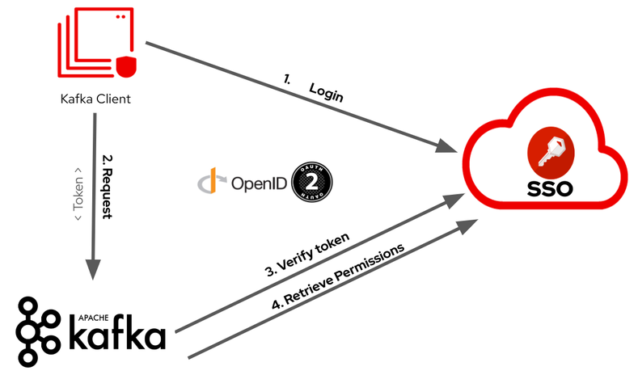

= Keycloak integration

WARNING: In this document, *Keycloak* and *Red Hat SSO* are interchangeable. The latter is the product made out of the upstream community project known as Keycloak. However, all the procedures are tested using *Red Hat SSO*.

TIP: This document was initially developed targeting fish shell, but it strives to provide also the bash alternatives. Here is a general rule, that will not be advertised further: the command `set -x ENV_VAR xxx` must be replaces with `export ENV_VAR=xxx`

== Prerequisites

This document expects:

* AMQ Streams operator deployed
* A Kafka cluster already deployed in your environment called `my-cluster`.
* No authorization configured

== Deploy and configure Keycloak

Create keycloak in its own namespace:

[source,shell]
----
oc new-project keycloak
oc apply -f k8s/keycloak/01-rhsso-operator-olm.yaml
oc apply -f k8s/keycloak/02-keycloak.yaml
----

Show the keycloak user and password:

[source,shell]
----
oc get secret credential-my-keycloak -o jsonpath='{.data.ADMIN_USERNAME}' |base64 -d
oc get secret credential-my-keycloak -o jsonpath='{.data.ADMIN_PASSWORD}' |base64 -d
----

Show the essential information about keycloak:

[source,shell]
----
oc describe keycloak my-keycloak
----

Create the `kafka` realm:

[source,shell]
----
oc apply -f k8s/keycloak/03-kafka-realm.yaml
----

A **client** is an application or service that interacts with Keycloak for authentication and authorization purposes

Clients can be of different types, including web applications, mobile applications, single-page applications (SPAs), and service accounts. Each client in Keycloak is assigned a unique client ID and can have its own set of configuration settings, security protocols, and access permissions.

We need 2 clients one for the consumer application and anouther for the producer one:

* client-id `kafka-consumer`
* client-id `kafka-producer`

They have to be configured: `confidential` and `service account enabled`.

In order to have predictable secrets and streamline the remaining part of the configuration, import a realm base configuration:

. Select the Kafka realm
. From the side menu select *Import*
. Upload the json file available in this repository: `docs/realm-no-pol.json`
. At question *If a resource exists* choose `Overwrite`

in addition to the two clients, the import prepares some definitions that will be useful later:

* `kafka-authz` client which hold the authorization configuration
* Realm roles: `topic-consumer` and `topic-producer`

== Kafka authentication

The following picture shows the authentication flow when the set up is completed:

Extract the Keycloak CA certificate:

[source,shell]
----
oc project my-kafka
set -x KEYCLOAK_ROUTE (oc get route keycloak -n keycloak -o jsonpath='{.spec.host}')
echo "" | openssl s_client -servername $KEYCLOAK_ROUTE -connect $KEYCLOAK_ROUTE:443 -prexit 2>/dev/null| openssl x509 -outform PEM > keycloak-ext.crt
----

Create a secret to hold the Keycloak CA:

[source,shell]
----
oc create secret generic oauth-server-cert --from-file=ca.crt=keycloak-ext.crt 
----

The following command adds a new Kafka listener that allows access to applications that bring the JWT token issued by keycloak:

[source,shell]
----
oc patch kafka/my-cluster --type=merge --patch-file=(cat k8s/keycloak/05-kafka-listener.yaml.patch | envsubst | psub)
----

TIP: Bash alternative: `oc patch kafka/my-cluster --type=merge -p "$(cat k8s/keycloak/05-kafka-listener.yaml.patch | envsubst)"`

This is the listener configuration:

[source,yaml]
----
spec:
  kafka:
    listeners:
      - name: external
        port: 9094
        type: route
        tls: true
        authentication:
          type: oauth 
          validIssuerUri: https://${KEYCLOAK_ROUTE}/auth/realms/kafka
          jwksEndpointUri: https://${KEYCLOAK_ROUTE}/auth/realms/kafka/protocol/openid-connect/certs
          checkIssuer: true
          checkAccessTokenType: true
          accessTokenIsJwt: true
          enableOauthBearer: true
          maxSecondsWithoutReauthentication: 3600 
          tlsTrustedCertificates: 
          - secretName: oauth-server-cert
            certificate: ca.crt
          disableTlsHostnameVerification: true 
----

== Client side configuration

In this section, you will configure the *kafka consumer* in your local environment to connect to the remote Kafka server using the OAuth authentication mechanism:

The client application needs to enstablish 2 TLS connections, in this example both endpoints are using self signed CA, so we create 2 truststores for Kafka and Keycloak respectively:

[source,shell]
----
oc get kafka my-cluster -o=jsonpath='{.status.listeners[?(@.name=="external")].certificates[0]}{"\n"}' > kafka-cluster-ca.crt
keytool -import -trustcacerts -alias root -file kafka-cluster-ca.crt -keystore truststore.jks -storepass password -noprompt
keytool -import -trustcacerts -alias root -file keycloak-ext.crt -keystore oauth-ssl-truststore.jks -storepass password -noprompt
----

Add application properties to enable the OAUTHBEARER authentication:

[source,shell]
----
set -x KAFKA_ROUTE (oc get kafka my-cluster -o jsonpath='{.status.listeners[?(@.name=="external")].bootstrapServers}')
echo | cat - k8s/keycloak/06-application.properties | envsubst >> kafka-consumer/src/main/resources/application.properties
----

Update the password in `application.properties` to match the secret in the Keycloak web console.

Make sure that OAuth dependecy is present in `pom.xml`

[source,xml]
----
<dependency>
  <groupId>io.strimzi</groupId>
  <artifactId>kafka-oauth-client</artifactId>
</dependency>
----

Run the kafka consumer:

[source,shell]
----
mvn -f kafka-consumer/pom.xml clean quarkus:dev
----

In order to do a quick check on the proper functioning of the consumer, we can inject some messages using the kafka producer available in the OCP cluster:

[source,shell]
----
oc scale deployment/kafka-producer --replicas=1
----

Remember to scale it down when a few messages are generated.

It's worth noting that the local application is using the OAuth authentication mechanism whereas the OCP producer has no authentication mechanism since it's accessing to Kafka through a different listener.

The following command adds the OAuth configuration to the producer using the respective `kafka-producer` user.

[source,shell]
----
echo | cat - k8s/keycloak/06-application.properties | envsubst | sed 's/consumer/producer/g' >> kafka-producer/src/main/resources/application.properties
----

Run the producer to check it's working as expected.

== Kafka Authorization

In this section, it will be enabled the Kafka authorization and the SSO will be used to retrieve the permission. The following picture shows the interactions between the parties:

=== Kafka Authorization model

Kafka operation: `Read`, `Write`, `Create`, `Delete`, `Alter`, `Describe`, `ClusterAction`, `DescribeConfigs`, `AlterConfigs`, `IdempotentWrite`, `CreateTokens`, `DescribeTokens`, `All`

Kafka resources:

* `Topic`
* `Group` represents the consumer groups in the brokers
* `TransactionalId` represents actions related to transactions
* `DelegationToken` represents the delegation tokens in the cluster
* `User`: CreateToken and DescribeToken operations can be granted to User resources to allow creating and describing tokens for other users

An API key (protocol) is represented by a specific request and response pair. Some of the commonly used operations include:

* `Produce`: The produce operation allows clients to send messages to Kafka brokers for storage and distribution. Clients send a produce request containing the messages they want to publish, and brokers respond with a produce response indicating the success or failure of the operation.
* `Fetch`: The fetch operation allows clients to retrieve messages from Kafka brokers. Clients send a fetch request specifying the topic, partition, and offset they want to read from, and brokers respond with a fetch response containing the requested messages.
* `Metadata`: The metadata operation retrieves metadata about topics, partitions, and brokers in the Kafka cluster. Clients can send a metadata request to obtain information such as the list of available topics, partition leaders, and replicas.
* `Offset Commit`: The offset commit operation is used by consumer clients to inform Kafka brokers about the progress of consuming messages. Clients send an offset commit request to commit the offsets of consumed messages, and brokers respond with an offset commit response.

Privileges can apply to specific tuples of protocol, operation and resources, e.g.:

[options="header"]
|===========================================================================================================================================
| PROTOCOL      | OPERATION       | RESOURCES        | NOTE 
| PRODUCE       |	Write	          | TransactionalId  | An transactional producer which has its transactional.id set requires this privilege 
| PRODUCE       |	IdempotentWrite	| Cluster	         | An idempotent produce action requires this privilege
| PRODUCE       |	Write	          | Topic	           | This applies to a normal produce action
| FETCH         |	Read            | Topic            | Regular Kafka consumers need READ permission on each partition they are fetching
| OFFSET_COMMIT | Read            | Group            | An offset can only be committed if it's authorized to the given group and the topic too
| OFFSET_COMMIT |	Read            | Topic	           | Since offset commit is part of the consuming process, it needs privileges for the read action
|===========================================================================================================================================

Further information: https://kafka.apache.org/documentation/#security_authz_primitives[Security Authorization Primitives]

=== Keycloak concepts

*Clients* are entities that interact with Keycloak to authenticate users and obtain tokens. Most often, clients are applications and services acting on behalf of users that provide a single sign-on experience to their users and access other services using the tokens issued by the server

*Permissions* are the individual actions or operations that a user or client can perform on a specific resource. For example, permissions can include actions like "read," "write," "create," or "delete" on a particular *resource*.

*Policies* are the rules or conditions that determine whether a user or client is granted or denied access to perform those permissions on a resource. Policies evaluate the permissions requested by a user or client and make access control decisions accordingly.

A *Role* is a set of permissions or access rights that can be assigned to users or clients. 

A *permission* associates the *object* being protected with the *policies* that must be evaluated to determine whether access is granted.

X CAN DO Y ON RESOURCE Z

where:

* X represents one or more users, roles, or groups, or a combination of them. You can also use claims and context here.
* Y represents an action to be performed, for example, write, view, and so on.
* Z represents a protected resource, for example: a topic, a consumer group.

*Scope-based Permission*: use it where a set of one or more client scopes is permitted to access an object.

*Resource-based Permission* defines a set of one or more resources to protect using a set of one or more authorization policies.

An *Authorization Service* is a component of an identity and access management (IAM) system that handles the process of granting or denying access to protected resources based on predefined policies and rules. Any *confidential client* can provide the authorization service.

=== Mapping Kafka Authorization in Keycloak

This section shows how to create a client with the authorization services enabled, then inside the client configuration how to define:

* roles
* resources
* permissions

Open the browser with the keycloak route URL.

See in section <<Kafka authentication>> how to retrieve the Keycloak administration user and password.

After the login, select the `Kafka` Realm.

IMPORTANT: If the import procedure worked without issues you can *jump* on <<Create Permissions>> section.

Create the client to host the kafka authorization service:

[source,shell]
----
oc apply -n keycloak -f k8s/keycloak/07-authz-client.yaml
----

Alternatively, via web console:

. Create `kafka-authz` client
. Set *Access Type* to `confidential`
. Switch on `Service Account Enabled`
. Switch on `Authorization Enabled`
. Save

==== Create and assign Roles

From the left menu select *Roles* and add 2 roles: `topic-consumer` and `topic-producer`.

Select the *Clients* entry from left menu:

. Select `kafka-consumer`
. Switch to the *Service Account Roles* tab
. Assign `topic-consumer` role

Repeat the previous steps for `kafka-producer` and `topic-producer`.

==== Decision Strategy

Affirmative decision strategy means that at least one permission must be evaluated positive.

Select the *Clients* entry from left menu and open the `kafka-authz` client.

. Switch to the *Authorization* tab
. In the nested tabs line, select *Settings*
. Set *Decision Strategy* to `Affirmative`
. Save

==== Create Authorization Scopes

Select the *Clients* entry from left menu and open the `kafka-authz` client.

. Switch to the *Authorization* tab
. In the nested tabs line, select *Authorization Scopes*
. Create the following scopes: `Read`, `Write`, `Describe`, `IdempotentWrite`

==== Create Resources 

In *Authorization* > *Resources*

. Delete the Default Resource
. Create the following resources: 
.. `Topic:event` and add all the available scopes
.. `Cluster:*` and add `IdempotentWrite` as scope

==== Create Permissions

Prerequisites:

* Roles are defined (at realm level)
* Resources are defined (at client level)
* Authorization Scopes are defined (at client level)

Grant permissions to _consume_ from a topic (Scope-based Permission):

. Navigate in `kafka-authz` client, then *Authorization* tab
. Delete `Default Permission` if it exists
. In the second level of tabs select *Permission*, from *Create Permission* drop down list select *Scope-Base*

.. Enter a meaningful *name*: `Topic consumers can read and describe topic:event`
.. In the *Resource* field select `Topic:event`
.. In the *Scope* field enter: `Read`, `Describe`
.. Create a new *Policy* select _Role Policy_

... Enter a meaningful *name*: `topic consumer policy`
... In *Realm Roles* select and add `topic-consumer`
... Save

.. Save

Grant permissions to any _consumer group_ (Resource-based Permission):

. Enter a meaningful _name_: `Topic consumers can use any consumer group`
. In the _Resources_ field select `Group:*`
. Select an existing policy e.g. `topic consumer` or create a new one

Grant permissions to _produce_ into a topic (Scope-based Permission):

. Enter a meaningful *name*: `Topic producer can write and describe topic:event`
. In the *Resource* field select `Topic:event`
. In the *Scope* field enter: `Write`, `Describe`
. Create a new *Policy* select _Role Policy_
.. Enter a meaningful *name*: `topic producer policy`
.. In *Realm Roles* select and add `topic-producer`
.. Save

. Save

Grant _IdempotentWrite_ permissions at Cluster level (Scope-based Permission):

. Enter a meaningful *name*: `Topic producer have IdempotentWrite grant at Cluster level`
. In the *Resource* field select `Cluster:*`
. In the *Scope* field enter: `IdempotentWrite`
. Add `topic producer policy`
. Save

=== Configure Kafka Authorization

The following command will set up Kafka to delegate the authorization to Keycloak

[source,shell]
----
oc patch kafka/my-cluster --type=merge --patch-file=(cat k8s/keycloak/08-kafka-authorization.yaml.patch | envsubst | psub)
----

TIP: Bash alternative: `oc patch kafka/my-cluster --type=merge -p "$(cat k8s/keycloak/07-kafka-authorization.yaml.patch | envsubst)"`

If the Keycloak definitions are correct, you can execute the local consumer and producer and check the normal message flow.

If you get an authorization exception on the client side, you can enable the logging in Kafka to investigate the OAuth behavior.

See xref:../README.adoc#Troubleshooting[Troubleshooting] for more information.

== Enable OAuth for client applications in OpenShift

Once the authorization is enabled at Kafka level, client applications cannot access to Kafka in an anonymous way, even if the connection comes from an internal listener.

=== Add authentication to the internal listener

Edit the Kafka listener section and add the following configuration:

[source,yaml]
----
      - name: tls
        port: 9093
        type: internal
        tls: true
        authentication:
          type: oauth 
          validIssuerUri: https://${KEYCLOAK_ROUTE}/auth/realms/kafka
          jwksEndpointUri: https://${KEYCLOAK_ROUTE}/auth/realms/kafka/protocol/openid-connect/certs
          checkIssuer: true
          checkAccessTokenType: true
          accessTokenIsJwt: true
          enableOauthBearer: true
          maxSecondsWithoutReauthentication: 3600 
          tlsTrustedCertificates: 
          - secretName: oauth-server-cert
            certificate: ca.crt
          disableTlsHostnameVerification: true 
----

TIP: You can copy and paste from the `external` listener the authentication properties

=== Add authentication to the application running on OpenShift

Create a secret to hold the trust stores:

[source,shell]
----
oc create secret generic kafka-client-truststores --from-file=truststore.jks --from-file=oauth-ssl-truststore.jks 
----

In order to update the OpenShift application deployment there are two options:

. Update the image building process via quarkus-openshift extension
. Update the existing deployment configurations

==== Update the image building process

Edit the _configmap_ in `kafka-consumer/src/main/kubernetes/openshift.yml` using the values from the following command:

[source,shell]
----
cat k8s/keycloak/09-configmap.template | envsubst
----

WARNING: Make sure that the previous `KAFKA_BOOTSTRAP_SERVERS` value is replaced.

Update `kafka-consumer/src/main/resources/application.properties`

[source,props]
----
quarkus.openshift.mounts.trustores-vol.path=/truststores
quarkus.openshift.secret-volumes.trustores-vol.secret-name=kafka-client-truststores
----

Finally, launch the image build:

[source,shell]
----
mvn -f kafka-consumer/pom.xml package -Dquarkus.kubernetes.deploy=true -DskipTests
----

Repeat the above procedure for the _producer_ application, but replace the client id and secrets accordingly.

==== Update the existing deployment configuration

The below instructions assume that the client applications are correctly functioning without authentication.

Edit the _configmaps_ issuing the following command:

[source,shell]
----
oc edit configmap kafka-consumer-config
----

Add configuration coming from following command:

[source,shell]
----
cat k8s/keycloak/09-configmap.template | envsubst
----

Update the Kafka consumer deployment to mount the secret containing the trust stores.

TIP: the following command line leverages the popular `jq` command line utility (http://stedolan.github.io/jq/).

[source,shell]
----
oc get deployment kafka-consumer -o json | jq '.spec.template.spec += { "volumes": [ { "name": "truststores-vol", "secret": { "secretName": "kafka-client-truststores" } } ] }' | jq '.spec.template.spec.containers[] += { "volumeMounts": [ { "name": "truststores-vol", "mountPath": "/truststores", "readOnly": true } ] } ' | oc apply -f -
----

Edit the producer _configmaps_ issuing the following command:

[source,shell]
----
oc edit configmap kafka-producer-config
----

Add configuration coming from following command:

[source,shell]
----
cat k8s/keycloak/09-configmap.template | envsubst | sed 's/consumer/producer/g'
----

Update the Kafka producer deployment to mount the secret containing the trust stores:

[source,shell]
----
oc get deployment kafka-producer -o json | jq '.spec.template.spec += { "volumes": [ { "name": "truststores-vol", "secret": { "secretName": "kafka-client-truststores" } } ] }' | jq '.spec.template.spec.containers[] += { "volumeMounts": [ { "name": "truststores-vol", "mountPath": "/truststores", "readOnly": true } ] } ' | oc apply -f -
----

== Related useful information

=== Super user configuration

To skip the authorization check, you can use a user with special powers AKA `superuser`.

Enable the authentication on the plain listener:

[source,yaml]
----
spec:
  kafka:
    listeners:
      - name: plain
        port: 9092
        type: internal
        tls: false
        authentication:
          type: scram-sha-512
----

Create `superuser`:

[source,shell]
----
oc apply -f k8s/31-user.yaml
----

Retrieve the password from the secret:

[source,shell]
----
oc get secret superuser -o yaml -o jsonpath='{.data.password}' | base64 -d
----

Edit the config map `oc edit configmap kafka-consumer-config` adding the following environment variables:

[source,yaml]
----
  KAFKA_BOOTSTRAP_SERVERS: my-cluster-kafka-bootstrap.my-kafka.svc:9092
  KAFKA_SASL_JAAS_CONFIG: |
    org.apache.kafka.common.security.scram.ScramLoginModule required username="superuser" password="mFdXcUQZgggRJd8SUkVTf5MU288091TH";
  KAFKA_SASL_MECHANISM: SCRAM-SHA-512
  KAFKA_SECURITY_PROTOCOL: SASL_PLAINTEXT
----

=== Clean up keycloak

[source,shell]
----
oc delete keycloakclients kc-kafka -n keycloak
oc delete keycloakrealms kafka -n keycloak
----

=== Client authentication configuration

In Apache Kafka, the `security.protocol` property is used to specify the security protocol to be used for communication between Kafka clients and brokers. The available options for the `security.protocol` property are as follows:

. `PLAINTEXT`: This is the default option and represents an insecure mode of communication where no security mechanisms are employed. Data is transmitted in plain text over the network.

. `SSL`: When `security.protocol` is set to SSL, Kafka clients and brokers use the SSL/TLS protocol to establish a secure encrypted connection. SSL provides encryption and server authentication, securing the data transmission between clients and brokers.

. `SASL_PLAINTEXT`: This option combines the Simple Authentication and Security Layer (SASL) protocol with plaintext communication. It enables authentication without encryption, suitable for environments where confidentiality is not a concern but authentication is required.

. `SASL_SSL`: This option combines the SASL protocol with the SSL/TLS protocol. It provides both authentication and encryption, ensuring secure communication between clients and brokers.

The `sasl.mechanism` property is used to specify the SASL (Simple Authentication and Security Layer) mechanism to be used for authentication between Kafka clients and brokers. The available options for the `sasl.mechanism` property are as follows:

. `PLAIN`: The PLAIN mechanism allows for username/password-based authentication. It sends the username and password in plaintext, so it should only be used with a secure underlying transport (such as SSL) to protect the credentials.

. `SCRAM-SHA-256`: SCRAM-SHA-256 (Salted Challenge Response Authentication Mechanism with SHA-256) is a secure mechanism for username/password-based authentication. It provides a secure challenge-response mechanism, protecting the credentials during authentication.

. `SCRAM-SHA-512`: Similar to SCRAM-SHA-256, SCRAM-SHA-512 is a more secure variant that uses the SHA-512 hashing algorithm for password-based authentication.

. `OAUTHBEARER`: The OAUTHBEARER mechanism is used for OAuth 2.0-based authentication. It allows clients to authenticate with Kafka brokers using OAuth 2.0 tokens obtained from an OAuth 2.0 authorization server.

. `GSSAPI`: GSSAPI (Generic Security Services Application Programming Interface) is commonly used for authentication in Kerberos environments. It provides strong authentication and security using Kerberos tickets.

The choice of `sasl.mechanism` depends on the specific authentication mechanism and infrastructure you have in place. GSSAPI is commonly used in Kerberos environments, while PLAIN, SCRAM-SHA-256, and SCRAM-SHA-512 are suitable for username/password-based authentication. OAUTHBEARER is used when integrating with OAuth 2.0-based authentication systems.

In a Quarkus application the previous options can be set through the following environment variables:

----
  KAFKA_SECURITY_PROTOCOL: SASL_SSL
  KAFKA_SASL_MECHANISM: OAUTHBEARER
----

=== Internal URL

If you want to a direct connection between Kafka and SSO leveraging the internal network, you can change the URL with the internal DNS but in this case, you also need to use the internal CA certificate:

[source,shell]
----
oc get secret sso-x509-https-secret -n keycloak -o jsonpath='{.data.tls\.crt}' |base64 -d >keycloak.crt

oc create secret generic oauth-server-cert --from-file=ca.crt=keycloak.crt
----

=== How to generate a JWT token

Obtain an access token from Keycloak using the client credentials flow:

[source,shell]
----
set ACCESS_TOKEN (curl -X POST https://$KEYCLOAK_ROUTE/auth/realms/kafka/protocol/openid-connect/token \
  --header 'Content-Type: application/x-www-form-urlencoded' \
  --data-urlencode 'grant_type=client_credentials' \
  --data-urlencode 'client_id=kafka-producer' \
  --data-urlencode 'client_secret=kafka-producer-secret' \
  --data-urlencode 'scope=openid' \
  --silent | jq -r '.access_token')
----

Use the obtained access token to retrieve the JWT by making a request to the Keycloak userinfo endpoint:

[source,shell]
----
curl -X GET 'https://'$KEYCLOAK_ROUTE'/auth/realms/kafka/protocol/openid-connect/userinfo' \
  --header "Authorization: Bearer $ACCESS_TOKEN" \
  --silent | jq -r '.sub'
----

=== Username claim

It's possible to pass the client id (a meaningful username) during the authentication phase:

. In the Keycloak web console, add username mapper in the client configuration

.. Open the client e.g. `client-secret-kafka`
.. Select the `Mappers` tab
.. Click `Add Builtin`
.. Tick at `username` token mapper
.. Click `Add selected` button

. On the Kafka side add the following configuration
+
[source,yaml]
----
spec:
  kafka:
    listeners:
      - authentication:
          userNameClaim: preferred_username 
----

If you enable the username claim but you haven't configured the mapper in Keycloak, you will get an authentication error on the client and in the server logs:

----
2023-06-06 17:50:29,556 DEBUG Runtime failure during token validation (ErrId: 5cbf1e54) (io.strimzi.kafka.oauth.server.JaasServerOauthValidatorCallbackHandler) [data-plane-kafka-network-thread-0-ListenerName(EXTERNAL-9094)-SASL_SSL-4]
io.strimzi.kafka.oauth.validator.ValidationException: Failed to extract principal - check usernameClaim, fallbackUsernameClaim configuration
    at io.strimzi.kafka.oauth.validator.JWTSignatureValidator.extractPrincipal(JWTSignatureValidator.java:449)
----

=== Idempotent Write at cluster level

By default, producers requires idempotent write privilege at cluster level otherwise you can spot the following error in the server logs:

----
2023-06-14 15:23:57,728 INFO Principal = OAuthKafkaPrincipal(User:687e5022-8276-497f-9c1e-659dd0643bb9, groups: null, session: 1850418031, token: eyJh**EyIg) is Denied Operation = Write from host = 10.130.0.2 on resource = Topic:UNKNOWN:NONE for request = InitProducerId with resourceRefCount = 0 (kafka.authorizer.logger) [data-plane-kafka-request-handler-0]
----

Make sure that you have 

* a resource `Cluster:*` with `IdempotentWrite` as scope

* a resource-scope permission on `Cluster:*` matching the producer client id (policy).
+
image:images/keycloak-cluster-permission.png[]

=== Further readings

* https://access.redhat.com/documentation/en-us/red_hat_amq_streams/2.4/html-single/deploying_and_managing_amq_streams_on_openshift.html#con-oauth-authentication-client-str

* https://access.redhat.com/documentation/en-us/red_hat_single_sign-on/7.6/html-single/authorization_services_guide/index

* https://medium.com/keycloak/secure-kafka-with-keycloak-sasl-oauth-bearer-f6230919af74

* https://medium.com/@mihirrajdixit/getting-started-with-service-accounts-in-keycloak-c8f6798a0675
