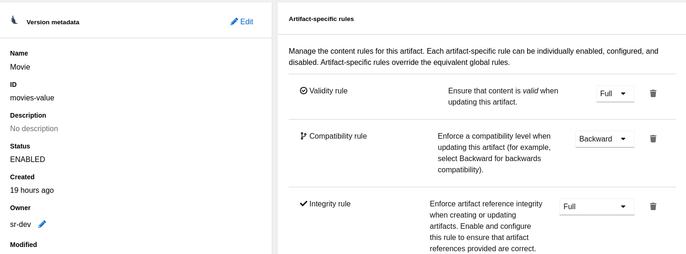

= Service Registry

Red Hat build of Apicurio Registry is a central data store for schemas and API artifacts. It is a datastore for standard event schemas and API designs. Developers can use it to decouple the data structure from their applications and share and manage the data structure using a REST interface.

It's based on Apicurio Registry open source community project.

== Prerequisites

This document expects:

* AMQ Streams operator deployed
* A Kafka cluster already deployed in your environment called `my-cluster`.
* No authorization configured
* Keycloak installed in the keycloak namespace
* Keycloak clients: kafka-producer 

== Install 

=== Install the Operator

In the left navigation menu, click *Operators* and then *OperatorHub*.
In the Filter by keyword text box, enter registry to find the *Red Hat Integration - Service Registry Operator*.

=== Deploy the Registry

The following commands:

* Extract the Kafka route
* Create a registry instance
* Expose the service externally

[source,shell]
----
set -x KAFKA_ROUTE (oc get kafka my-cluster -o jsonpath='{.status.listeners[?(@.name=="plain")].bootstrapServers}')
set -x PROJECT_DOMAIN (oc project -q).(oc get ingresses.config/cluster -o jsonpath={.spec.domain})
cat k8s/registry/01-registry.yaml | envsubst | oc apply -f -
oc create route edge --service=registry-service --insecure-policy=Redirect
----

It's worth noting that the configuration includes the `host` property, which is used for CORS permissions in the registry web app.

=== Enable Registry security

NOTE: The following instructions assume that Keycloak has been installed in accordance with the other directions in this repository.

The following command update the previous registry deployment to enable the authentication through Keycloak:

[source,shell]
----
set -x KEYCLOAK_ROUTE (oc get route keycloak -n keycloak -o jsonpath='{.spec.host}')
oc patch apicurioregistry/registry --type=merge --patch-file=(cat k8s/registry/02-security.yaml | envsubst | psub)
----

Optionally, you can enable the authorization and the following definitions can be used to import in Keycloak the clients and roles expected by the Service Registry: link:../docs/sso-registry.json[]

This will create 3 roles (sr-developer, sr-admin, sr-readonly) and 2 clients (registry-client-api, registry-client-ui).

== Register a schema

Open the registry web console (get the URL with: `oc get route registry-service -o jsonpath='{.spec.host}'`)

Upload the Avro schema available here:

link:../kafka-registry/src/main/avro/movie.avsc[Movie Avro schema]

Use the following ID: `movies-value`

IMPORTANT: The ID is then used by the client application to retrieve and validate the schema. 
The convention for the schema ID is `<topic name>-value`. 

== Kafka Registry application

`kafka-registry` is a simple Quarkus application that reads and writes messages in a Kafka topic called `movies`.

The application is configured to validate the message schema against Apicurio Registry.

See registry section in link:../kafka-registry/src/main/resources/application.properties[application.properties]

=== Prerequisites

To run it locally it requires access to: Kafka, Registry and Keycloak.

For sake of simplicity, Kafka is supposed to be exposed with a simple TLS listener:

[source,yaml]
----
spec:
  kafka:
    listeners:
    - name: tls
      port: 9093
      tls: true
      type: route
----

If you haven't already done so, the following commands will create the TLS truststore:

[source,shell]
----
oc get kafka my-cluster -o=jsonpath='{.status.listeners[?(@.name=="tls")].certificates[0]}{"\n"}' > kafka-cluster-ca.crt
cat kafka-cluster-ca.crt
keytool -import -trustcacerts -alias root -file kafka-cluster-ca.crt -keystore truststore.jks -storepass password -noprompt
----

Configure the environment variables:

[#env-script]
[source,shell]
----
set -x KAFKA_ROUTE (oc get kafka my-cluster -o jsonpath='{.status.listeners[?(@.name=="tls")].bootstrapServers}')
set -x KEYCLOAK_ROUTE (oc get route keycloak -n keycloak -o jsonpath='{.spec.host}')
set -x SERVICE_REGISTRY_URL (oc get route registry-service -o jsonpath='{.spec.host}')
set -x OAUTH_TOKEN_ENDPOINT https://$KEYCLOAK_ROUTE/auth/realms/kafka/protocol/openid-connect/token
set -x CLIENT_ID kafka-producer
set -x CLIENT_SECRET kafka-producer-secret
----

=== Run application version 1

To simulate the release of application version 1, the following command will compile the current application (uber-jar) which relies on the Avro schema version 1:

[source,shell]
----
cd kafka-registry
mvn package -Dquarkus.package.type=uber-jar
java -Dquarkus.http.port=8090 -jar target/kafka-registry-1.0.1-SNAPSHOT-runner.jar
----

In another terminal, launch the consumer version 1:

[source,shell]
----
curl -N http://localhost:8090/consumed-movies
----

=== Update the schema

Edit link:../kafka-registry/src/main/avro/movie.avsc[movie avro schema] and add the following snippet after `year` field.

[source,json]
----
    ,{
        "name": "rating",
        "type": "int",
        "default": 0
    }
----

IMPORTANT: `default` annotation makes the field optional, preserving the _backward compatibility_.

Open the registry console and select the Movie schema:

. Enable all the rules: *validation*, *compatibility* and *integration*
+

. Click *Upload new version*

=== Run application version 2

In this section, you will launch in parallel a new version of the application using the updated version of the schema. Since the schema is backward compatible the two application will be able to produce and consume messages in parallel.

. In order to let the new application consume messages in parallel with the previous release, you have to change the consumer group. In the 
 link:../kafka-registry/src/main/resources/application.properties[application.properties] add the following line:
+
----
mp.messaging.incoming.movies-from-kafka.group.id=registry-2
----

. Open a new terminal and switch to repository root folder

. Set the <<env-script,environment variable>>

. Launch Kafka Registry application in _dev mode_: `mvn -f kafka-registry/pom.xml quarkus:dev`

Launch the new consumer:

. Open a new terminal and launch the message consumer:
+
[source,shell]
----
curl -N http://localhost:8080/consumed-movies
----

. Open a new terminal and produce a message:
+
[source,shell]
----
curl --header "Content-Type: application/json" \
     --request POST \
     --data '{"title":"The Good, the Bad and the Ugly","year":1966,"rating":5}' \
     http://localhost:8080/movies
----

. Check the consumers behavior in their own terminal:

* In the version 1 (attached on port 8090) you should see the following line:
+
----
data:{"title": "The Good, the Bad and the Ugly", "year": 1966}
----

* In the version 2 (attached on port 8080) the log shows the rating information:
+
----
data:{"title": "The Good, the Bad and the Ugly", "year": 1966, "rating": 5}
----

. Produce a message through the version 1 application (port 8090):
+
[source,shell]
----
curl --header "Content-Type: application/json" \
     --request POST \
     --data '{"title":"Blade Runner","year":1982}' \
     http://localhost:8090/movies
----

. Check the consumers behavior in their own terminal:

* In the version 1 (attached on port 8090) you should see the following line:
+
----
data:{"title": "Blade Runner", "year": 1982}
----

* In the version 2 (attached on port 8080) the log shows the rating information:
+
----
data:{"title": "Blade Runner", "year": 1982, "rating": 0}
----

== Breaking change

In this section, you will make a breaking schema change and observe how the application reacts in this situation.

=== Upload a forward compatible schema

Edit link:../kafka-registry/src/main/avro/movie.avsc[movie avro schema] to remove the `default` definition. The rating field should resemble the following snippet:

[source,json]
----
    ,{
        "name": "rating",
        "type": "int"
    }
----

Open the registry console and select the Movie schema:

. Disable *compatibility*  rule (or switch to `forward`)

. Upload the previously updated schema 

=== Launch application version 1

If you have stopped the application version 1, make sure that the environment variables are set and run it again:

[source,shell]
----
java -Dquarkus.http.port=8090 -jar target/kafka-registry-1.0.1-SNAPSHOT-runner.jar
----

In another terminal window, run the consumer. If you already have an open terminal for that purpose, you can reuse it. Check if the curl command is still running otherwise:

[source,shell]
----
curl -N http://localhost:8090/consumed-movies
----

=== Launch application version 2

If you have stopped the quarkus dev mode, run it again in its own terminal window.

In another terminal window, run the consumer for the version 2. If you already have an open terminal for that purpose, you can reuse it. Check if the curl command is still running otherwise:

[source,shell]
----
curl -N http://localhost:8080/consumed-movies
----

=== Produce a message in version 2

Open a new terminal and produce a message:

[source,shell]
----
curl --header "Content-Type: application/json" \
     --request POST \
     --data '{"title":"The Good, the Bad and the Ugly","year":1966,"rating":5}' \
     http://localhost:8080/movies
----

Examine the logs of the consumers on their respective windows. You should observe that both were successfully able to consume the messages, and handle the data they were designed to read.

=== Produce a message in version 1

Now trigger the producer for the application version 1:

[source,shell]
----
curl --header "Content-Type: application/json" \
     --request POST \
     --data '{"title":"Blade Runner","year":1982}' \
     http://localhost:8090/movies
----

In the application version 1 terminal, you will get the following error:

[source,shell]
----
SRMSG18260: Unable to recover from the serialization failure (topic: movies), configure a SerializationFailureHandler to recover from errors.: java.lang.IndexOutOfBoundsException: Invalid index: 2
----

Why did this happen? The serializer attempts to utilize the latest schema from the registry, but it is unable to determine how to set the `rating' field (no more default definition), so it has to fail!

You can try to remove the `year` field and repeat the tests.

== Conclusions

Finally, you can close all pending processes and draw the conclusions: the registry is a powerful tool that keep the topics content healthy:

- Producers are prevented to generate inconsistent messages.
- Consumers are quite tolerant to changes as long as can get the required information.
- The Registry is the single source of truth for your client applications, developers can retrieve the latest artifacts, designated users can govern the schema evolution (public contract).

== Appendix

=== Dirty topic

It might happen that you are not able to reproduce a previous testing scenario, because some erroneous sequence of actions caused the `movies` topic to have an inconsistent message that cannot be consumed. In such cases, the quick solution is to stop the running clients and delete the topic:

[source,shell]
----
oc delete kt movies
----

=== Schema automatic download

It's possible to configure maven to automatically retrieve the artifact from the repository:

[source,xmls]
----
<plugin>
  <groupId>io.apicurio</groupId>
  <artifactId>apicurio-registry-maven-plugin</artifactId>
  <version>2.4.4.Final</version>
  <executions>
      <execution>
        <phase>generate-sources</phase>
        <goals>
            <goal>download</goal> 
        </goals>
        <configuration>
            <registryUrl>https://<REGISTRY_DOMAIN>/apis/registry/v2</registryUrl>
            <authServerUrl>https://<KEYCLOAK_DOMAIN>/auth/realms/kafka/protocol/openid-connect/token</authServerUrl>
            <clientId>kafka-producer</clientId>
            <clientSecret>kafka-producer-secret</clientSecret>
            <artifacts>
                <artifact>
                    <groupId>quarkus</groupId>
                    <artifactId>movies-value</artifactId>
                    <file>${project.basedir}/src/main/avro/movie.avsc</file>
                    <overwrite>true</overwrite>
                </artifact>
            </artifacts>
        </configuration>
    </execution>
  </executions>
</plugin>
----

=== External References

* https://quarkus.io/version/2.13/guides/kafka-schema-registry-avro[Quarkus tutorial]
* https://access.redhat.com/documentation/en-us/red_hat_build_of_apicurio_registry/2.4/html-single/apicurio_registry_user_guide/index#registry-serdes-config-props_registry[Apicurio doc - Serde configurtation]
* https://github.com/Apicurio/apicurio-registry/issues/1592#issuecomment-870495742[Clarification on the lookup mechanism]